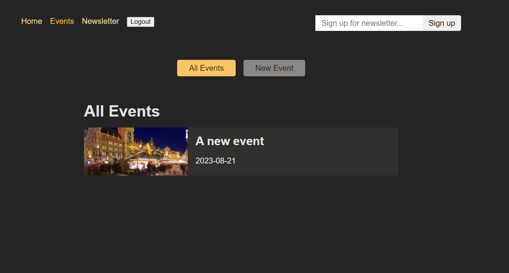

# Eventify using react

Eventify is a modern event management website built using React.js. It provides users with a platform to discover, explore, and attend various events happening in their area or globally. Eventify offers a user-friendly interface, intuitive navigation, and robust features to enhance the event browsing and booking experience.

Click here for a <a target="_blank" href="https://shashank-eventify-react.onrender.com"> DEMO </a>

## Setup

Clone the repository

```
$ git clone https://github.com/shashankhl/Eventify.git
```

```
$ npm run start
```

for both frontend and backend

## About

### Key Features:

Event Listings: Browse through a diverse range of events categorized by type, date, location, and popularity.

Event Details: View detailed information about each event, including title, date, time, location, description, ticket prices, and event organizers.

Search Functionality: Search for specific events based on keywords, location, date range, or category to quickly find relevant events.

User Authentication: Sign up and log in to create personalized profiles, save favorite events, manage bookings, and receive notifications.

Event Creation: Event organizers can create and manage events, set ticket prices, specify venue details, upload event banners, and track attendee registrations.

Social Integration: Share events on social media platforms, invite friends, and see which events are trending or popular among users.

Responsive Design: Enjoy a seamless browsing experience across various devices, including desktops, laptops, tablets, and smartphones.

### Technology Stack:

Frontend: React.js, React Router, Redux (optional for state management), HTML5, CSS3, JavaScript ES6+
Backend: Node.js (Express.js for RESTful APIs), MongoDB (or another database for storing event data), RESTful APIs for communication between frontend and backend
Authentication: JSON Web Tokens (JWT) for user authentication and authorization
Deployment: Host frontend on platforms like Netlify or Vercel, backend on platforms like Heroku or AWS


